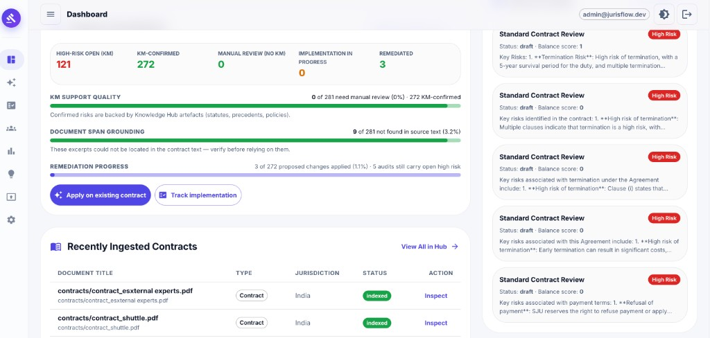
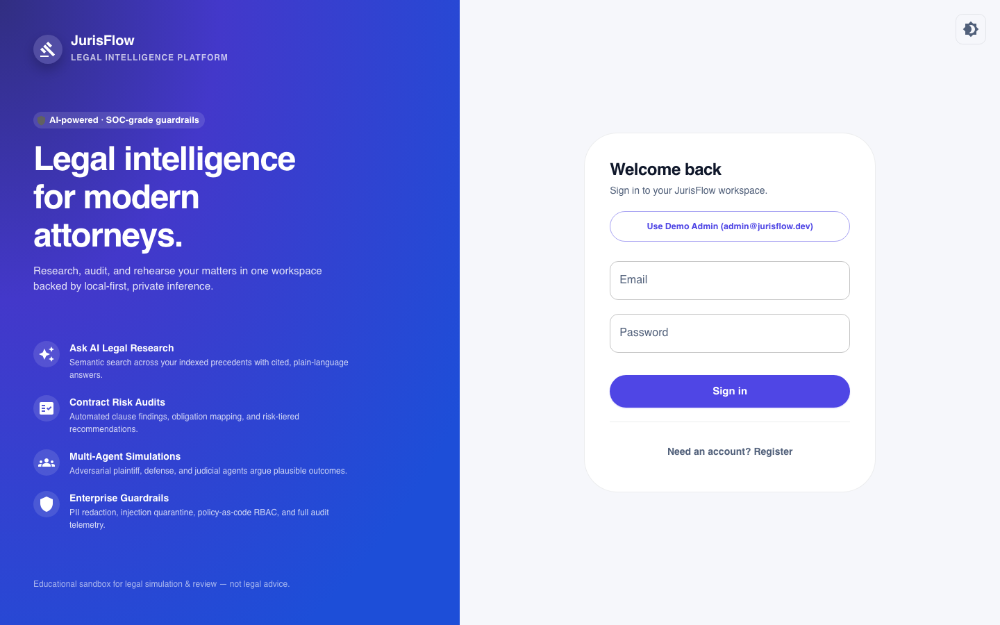

# JurisFlow

Enterprise legal intelligence — **knowledge hub**, **grounded contract review**,
**multi-agent tribunal simulation**, **training pack + audio**, and **risk insights**.

OPA/Rego default-deny. Local-first LLM with cloud adapters when you need them.

> **Educational only — not legal advice.**

<p align="center">
  
</p>

<p align="center">
  
</p>

## What you get

| Capability | Notes |
|---|---|
| Enterprise knowledge hub | Artefacts indexed · hybrid search · Ask AI |
| Grounded review | KM-confirmed findings · manual-review residuals |
| Fleet of agents | Policy Reviewer · Plaintiff · Defendant · Judge · Informer · Witness |
| Tribunal simulation | LangGraph · HITL · turn budget · case study |
| Training pack | Dual-track TTS (overview + hearing) |
| Risk insights | Practice intelligence · KPIs |

## Quick start

Prerequisites: Python 3.14, Node 20+, [Ollama](https://ollama.com) with a chat model
(`llama3.2:latest` default) and embeddings (`all-minilm`).

```bash
make install                 # .venv + backend deps
make seed                    # admin@jurisflow.dev / ChangeMe#2026
make start                   # API :5600 · Vite :5601
open http://127.0.0.1:5601
```

Showcase deck (in-app): **Showcase** nav · `/#/showcase`

## Configuration

`.env` with `JAIL_` prefix (copy `.env.example` → `backend/.env`):

| Area | Default | Notes |
|---|---|---|
| LLM | Ollama `llama3.2:latest` | Adapters: Ollama (private) · OpenRouter/Vertex (cloud per use-case) · **no silent fallback** |
| Embeddings | Ollama `all-minilm` | `JAIL_EMBEDDING_PROVIDER` |
| Vector store | Qdrant embedded | `JAIL_QDRANT_URL` / Vertex optional |
| TTS | edge-tts | Overview + multi-voice hearing |
| DB | SQLite | Postgres via `JAIL_DATABASE_URL` |
| Policy | Embedded OPA | `JAIL_OPA_URL` for external OPA |

## Workflows

- **Simulations** — scenario → LangGraph agents → HITL (pause / inject / steer) → verdict → case study + audio
- **Review** — upload → extract → KM-grounded findings → publish / export
- **Knowledge hub** — hybrid search · collections · Ask AI with citations
- **Analytics** — usage KPIs · agent telemetry

## Auth & authorization

JWT access + refresh. Platform + module roles. Every API / MCP / A2A / export call
goes through Rego — **default deny**.

## Repo layout

```
backend/     FastAPI + LangGraph + SQLAlchemy + LLM/TTS adapters
frontend/    React + Vite + MUI · public/showcase/
policies/    OPA/Rego (+ tests)
eval/        DeepEval + promptfoo
scripts/     start / stop / remake
infra/       Docker + Kubernetes
docs/        architecture · tech-architecture · threat model · acceptance
```

## Docs

- [`docs/architecture.md`](docs/architecture.md) — component topology · flows · config
- [`docs/tech-architecture.md`](docs/tech-architecture.md) — tech bets · LLM routing · agents
- [`docs/threat-model.md`](docs/threat-model.md) — trust boundaries
- [`docs/acceptance.md`](docs/acceptance.md) — acceptance walkthrough
- [`docs/openapi.json`](docs/openapi.json) — OpenAPI contract
- [`docs/proposition.md`](docs/proposition.md) — presentation notes
- [`eval/README.md`](eval/README.md) — `make eval`

## Verification

```bash
make test          # backend pytest + Rego
make lint          # ruff
make typecheck     # mypy
make eval          # DeepEval + promptfoo (live API + Ollama)
```

## Assumptions & limitations

- Local Ollama latency is hardware-bound; small models may yield thinner turns.
- OCR via Tesseract for image PDFs; malware scan is a placeholder hook.
- In-memory rate limits — use Redis/edge for multi-instance.
- SQLite is for but; Postgres is the production target.

---

JurisFlow output is **educational and informational, not legal advice**.
