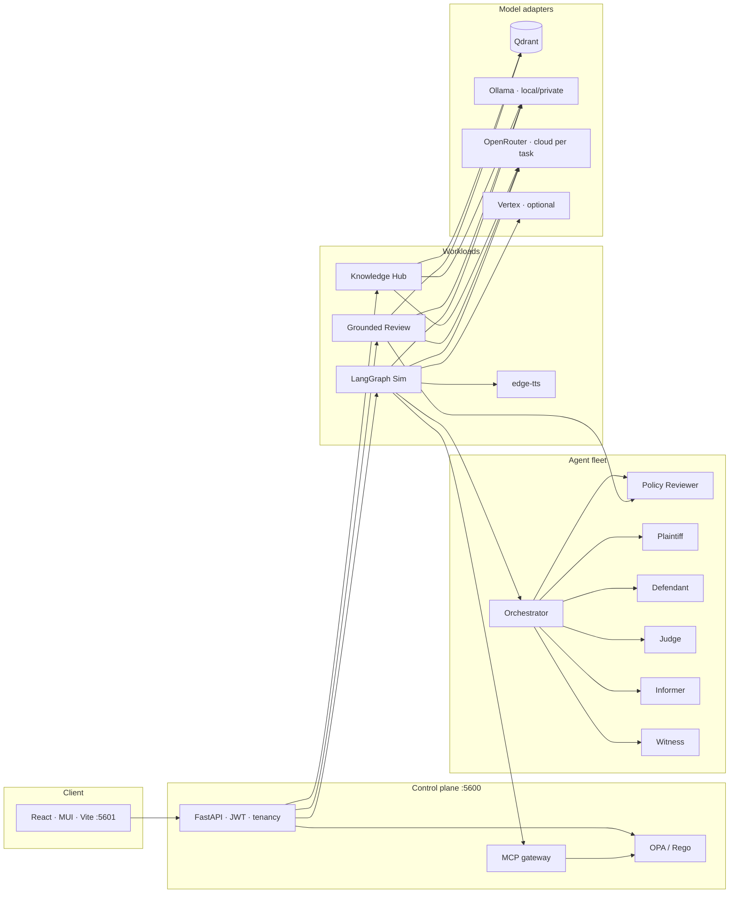

# JurisFlow Architecture

Enterprise legal intelligence: **knowledge hub**, **grounded contract review**,
**multi-agent tribunal simulation**, **training pack + TTS**, and **risk insights**.
OPA/Rego default-deny on every API, MCP tool, and A2A message.

*Educational product — not legal advice.*

## Runtime topology

| Layer | Role |
|---|---|
| **Frontend** | React + MUI; Vite proxies `/api` → `:5600`; Showcase at `/showcase/` |
| **API** | FastAPI; JWT access/refresh; org tenancy |
| **Policy** | Embedded OPA/Rego — RBAC, tenant, MCP, A2A, export; `policy_selfcheck()` on boot |
| **Hub** | Ingest · chunk · embed · hybrid search · collections · Ask AI |
| **Review** | Policy Reviewer agent · clause/risk extraction · KM-confirmed vs manual-review · remediations |
| **Sim** | LangGraph tribunal fleet · HITL pause/inject/steer · turn budget · case study |
| **Audio** | edge-tts overview + multi-voice hearing tracks |
| **Vectors** | Qdrant (embedded/local or server); optional Vertex Vector Search |
| **LLM** | Adapter-selected: **Ollama** (private/offline), **OpenRouter** (cloud per use-case), **Vertex** (GCP) — no silent fallback |

## Key flows

1. **Ingest** — Knowledge Artefact vs Contract Review (distinct categories)
2. **Audit** — findings grounded in KM; unsupported → *manual-review*
3. **Sim** — agents argue under turn limit → LLM-as-judge verdict → case study
4. **Pack** — practice intelligence · dual audio · export with disclaimer

## Configuration surface

`.env` with `JAIL_` prefix (`backend/.env`, see `.env.example`):

| Area | Keys (examples) |
|---|---|
| LLM | `JAIL_LLM_PROVIDER` (`ollama` \| `vertex` · OpenRouter adapter planned/config-routed) |
| Ask AI | `JAIL_ASK_LLM_MODEL` |
| Embeddings | `JAIL_EMBEDDING_PROVIDER`, model name |
| Vectors | `JAIL_VECTOR_PROVIDER`, `JAIL_QDRANT_URL` |
| TTS | `JAIL_TTS_ENABLED`, `JAIL_TTS_PROVIDER=edge`, voice map |
| DB / storage | `JAIL_DATABASE_URL`, `JAIL_STORAGE_BACKEND` |
| Sim limits | turn limit, judge effort / max rounds |

## Repository map

| Path | Purpose |
|---|---|
| `backend/app` | API, agents, review, hub, TTS/audio, MCP/A2A, OPA |
| `policies/` | Rego packs + 25-case matrix |
| `frontend/` | App + `public/showcase/` deck |
| `eval/` | DeepEval + promptfoo |
| `docs/` | Architecture, tech architecture, threat model, acceptance, OpenAPI |
| `scripts/` | start / stop / remake |
| `infra/` | Docker / K8s |
